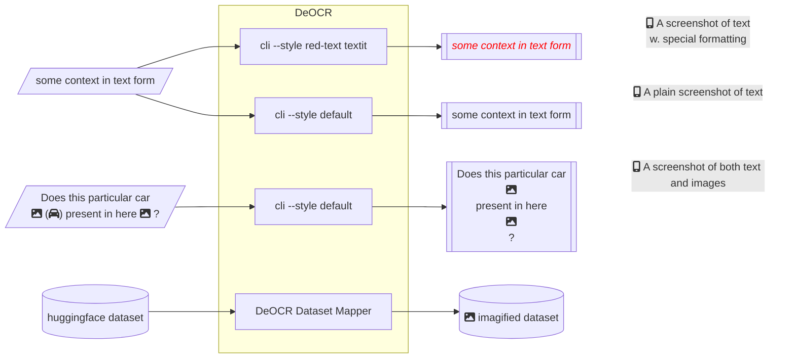

# DeOCR

DeOCR (de-cor), A reverse OCR tool that transforms text datasets (JSON, CSV) to images of specified sizes (e.g., `512x512` or `1024x1024`). This tool can be considered as a text-to-image data pre-processing component in pipelines such as [DeepSeek-OCR](https://github.com/deepseek-ai/DeepSeek-OCR).



# Quick Start

```sh
# TODO: this is not ready yet
pip install deocr
```

<details><summary>Alternatively, install from source</summary>

```sh
# uv
uv add "deocr @ https://github.com/Moenupa/DeOCR.git"
# for pip or conda
pip install "git+https://github.com/Moenupa/DeOCR.git"
```

For development, please use uv to manage the environment:

```sh
git clone https://github.com/Moenupa/DeOCR.git
cd DeOCR
uv venv
uv sync --dev
pre-commit install
```

</details>
