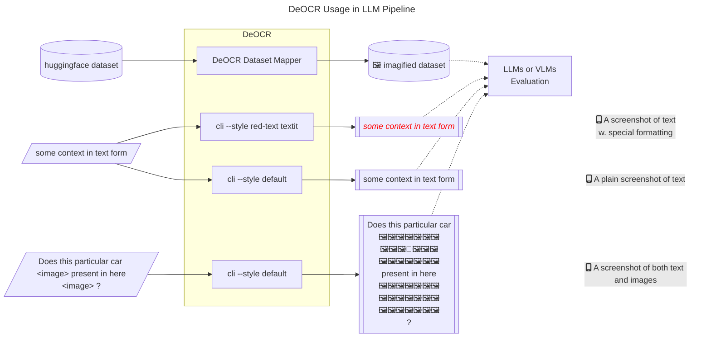
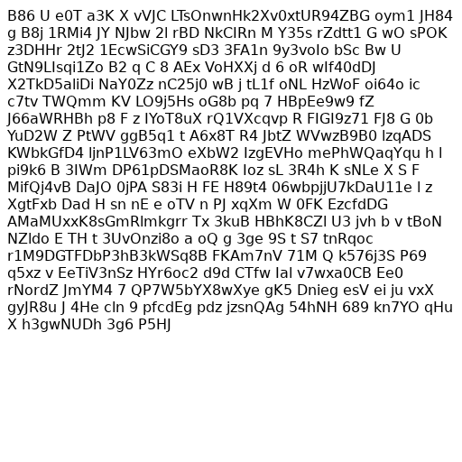

# DeOCR

DeOCR (de-cor), A reverse OCR tool that renders huggingface-compatible datasets to images of specified sizes (e.g., `512x512`). This tool can be considered as a text-to-image data pre-processing component in pipelines such as [DeepSeek-OCR](https://github.com/deepseek-ai/DeepSeek-OCR).



<details><summary>Here is an output example, sized `512x512`, with random string as context</summary>



</details>

# Quick Start

```sh
pip install deocr[playwright,pymupdf]
# activate your python environment, then install playwright deps
playwright install chromium
```

<details><summary>Alternatively, install from source</summary>

```sh
# uv
uv add "deocr[playwright,pymupdf] @ git+https://github.com/Moenupa/DeOCR.git"
# activate your python environment, then install playwright deps
playwright install chromium
```

</details>

<details><summary>For development</summary>

Please use uv to manage the environment:

```sh
git clone https://github.com/Moenupa/DeOCR.git
cd DeOCR
uv venv
uv sync --all-extras --all-groups
source .venv/bin/activate
playwright install chromium
pre-commit install
```

</details>

<details><summary>Known Issues</summary>

- async function timeout: increase threshold 0.05 at [datasets/utils/py_utils.py:612-626](./.venv/lib/python3.12/site-packages/datasets/utils/py_utils.py)

</details>
